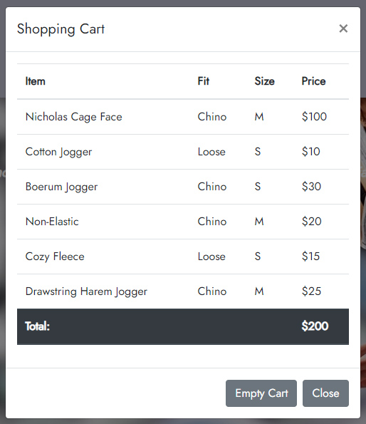
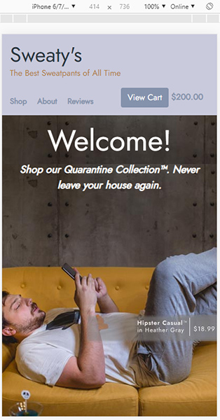

# NSS E12 Group Project - Sweaty's

## Description:
The objective of the group project was to create an e-commerce site for sweatpants. The project used HTML, CSS, JavaScript, and Bootstrap. 

The Sweatpants Group:
>1. @MLogan1998
>1. @wcampbell91
>1. @nathanieltylerowens
>4. @petestewart72

## Features:
1. Responsive Design
1. Categories on Homepage link to shop page and filter contents.
1. Shopping Cart data stored in localStorage. Data saved after page reloads, and across browser sessions.
1. Nav bar updates cart total when item added, persists on navigation to new page and across broswer sessions. 

## Screenshots
 ##### Homepage

##### Shopping Cart

##### Responsive Design
